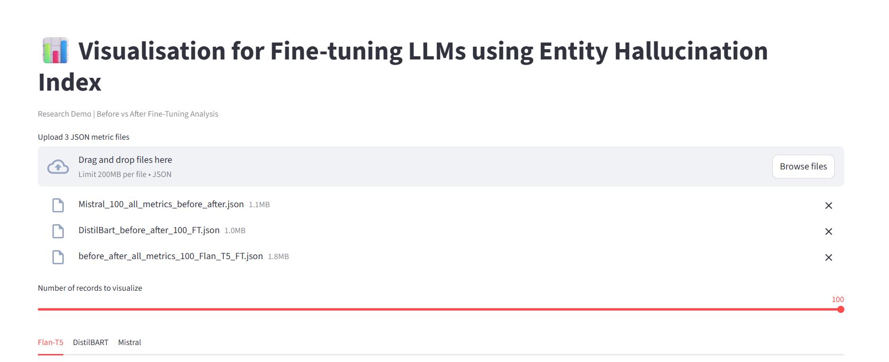
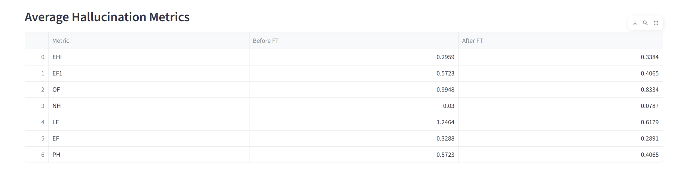
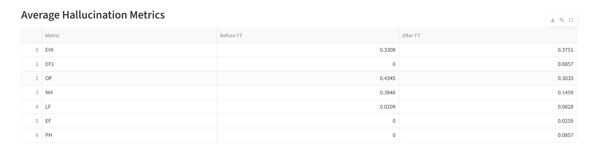
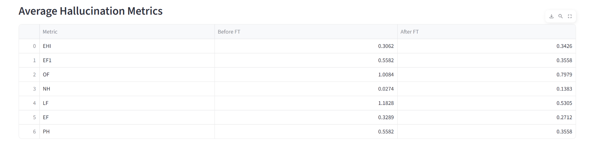
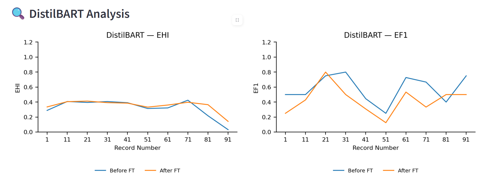
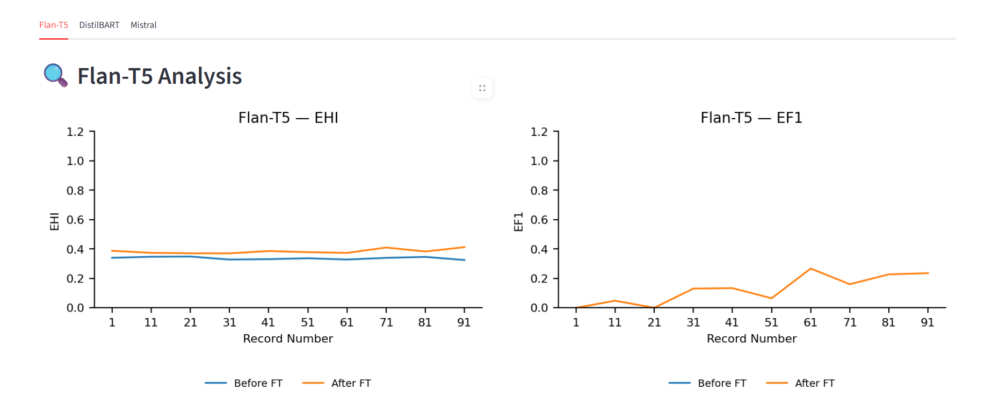
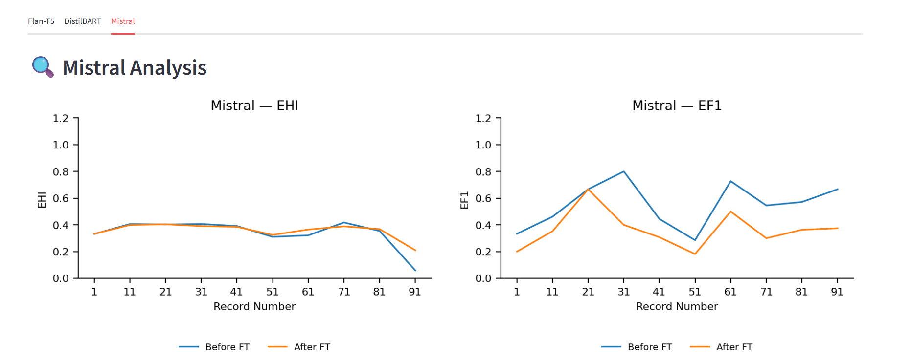
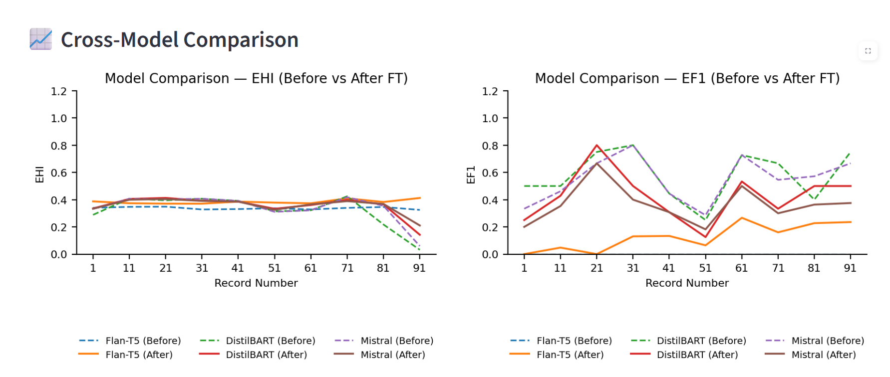

# Fine-Tuning LLMs Using Entity Hallucination Index (EHI)

## 📌 Overview

This repository provides an end-to-end framework for analyzing, visualizing, and reducing
**entity-level hallucinations in Large Language Models (LLMs)** using a set of **novel,
entity-centric evaluation metrics**.

The repository contains:
- 📊 Interactive Streamlit visualizations
- 🧠 LLM fine-tuning codebase
- 📈 Metric plots and result snapshots
- 🧪 Entity-aware evaluation beyond traditional ROUGE metrics

The primary goal is to **quantitatively measure factual faithfulness at the entity level**
and enable fine-tuning strategies that reduce hallucination while preserving useful abstraction.

---

## 📊 Streamlit Visualization

The Streamlit application provides:

- Before vs After Fine-Tuning comparison
- Metric-wise line plots (EHI, EF1, PH, OF, NH, LF, EF)
- Combined hallucination metric plots
- Cross-model comparison (Mistral, DistilBART, Flan-T5)
- Average metric tables

### ▶️ Run the App

```bash
streamlit run Streamlit_App_EHI.py

---

## 📸 Results & Visualizations

### 🧪 Streamlit UI Overview


---

### 📊 Average Metric Tables

**DistilBART**


**Flan-T5**


**Mistral**


---

### 📈 Model-wise EHI & EF1 Line Plots

**DistilBART**


**Flan-T5**


**Mistral**


---

### 🔄 Cross-Model Comparison



